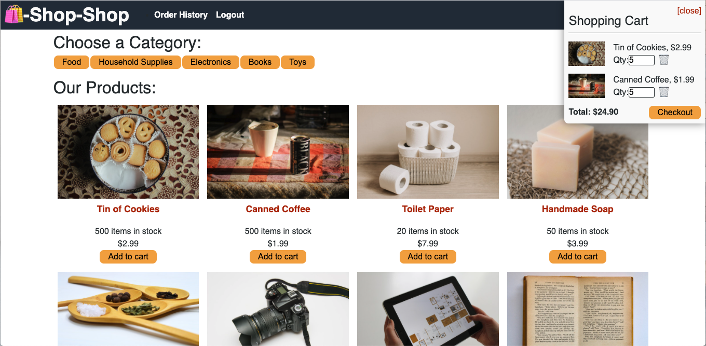
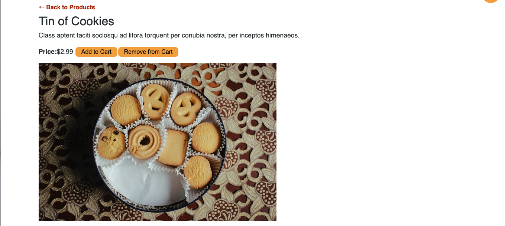

# Shop-Shop
>An eCommerce site that allows you to purchase goods (but not really).

## Table of contents
* [General info](#general-info)
* [Installation](#installation)
* [Functionality](#functionality)
* [Screenshots](#screenshots)
* [Status](#status)
* [Link](#link)
* [License](#license)
* [Contact](#contact)

## General info
This program will allow you to add and remove items from your cart and checkout through Stripe.

## Installation
Steps required to install project and how to get the development environment running:

- Clone the repo to your own system.
- Run npm install from the command line in the root directory
- Invoke the application with "npm start"

This will connect you to the localhost:3001 where you can test the app.

You may also test the app through the Heroku link listed in the links section.

Additionally, since this is a PWA, supported browsers will allow you to install the program as an App. After loading the page in a browser, you should see a + inside of a circle on the right side of the address bar. Click on this and follow the prompts to install the program as a local App.

## Functionality
This is a basic eCommerce website that uses Stripe to collect your credit card information. You are able to view the items as a page, or view each individual item by clicking on them. If you have created a login, you can then add them to your cart. You are also able to remove items from your cart by either clicking on the "Remove Items" button on an individual items page or clicking the trash icon in your cart. You can also manually change the item number in your cart.

## Screenshots

## Status
Project is: _complete_ (for now)

## Links
 - Respository Link - https://github.com/JohnNielsen1221/shop-shop
 - Heroku Link - https://afternoon-dusk-67639.herokuapp.com/

## License
Permission is hereby granted, free of charge, to any person obtaining a copy of this software and associated documentation files (the "Software"), to deal in the Software without restriction, including without limitation the rights to use, copy, modify, merge, publish, distribute, sublicense, and/or sell copies of the Software, and to permit persons to whom the Software is furnished to do so, subject to the following conditions:

The above copyright notice and this permission notice shall be included in all copies or substantial portions of the Software.

THE SOFTWARE IS PROVIDED "AS IS", WITHOUT WARRANTY OF ANY KIND, EXPRESS OR IMPLIED, INCLUDING BUT NOT LIMITED TO THE WARRANTIES OF MERCHANTABILITY, FITNESS FOR A PARTICULAR PURPOSE AND NONINFRINGEMENT. IN NO EVENT SHALL THE AUTHORS OR COPYRIGHT HOLDERS BE LIABLE FOR ANY CLAIM, DAMAGES OR OTHER LIABILITY, WHETHER IN AN ACTION OF CONTRACT, TORT OR OTHERWISE, ARISING FROM, OUT OF OR IN CONNECTION WITH THE SOFTWARE OR THE USE OR OTHER DEALINGS IN THE SOFTWARE.

## Contact
Created by John Hayes Nielsen - johnhayesnielsen@gmail.com